# 骨科知识图谱结构文档

## Neo4j 节点类型和关系

### 节点类型 (Node Types)

1. **Disease** - 疾病节点
   - 属性: name (名称), overview (概述)

2. **Location** - 发病部位节点
   - 属性: name

3. **Cause** - 病因节点
   - 属性: description

4. **Pathology** - 病理节点
   - 属性: description

5. **Description** - 描述特征节点
   - 属性: text

6. **AnatomicalLocation** - 解剖部位节点
   - 属性: name

7. **Severity** - 程度节点
   - 属性: level

8. **Duration** - 持续时间节点
   - 属性: period

9. **ReferredPain** - 转移性疼痛节点
   - 属性: description

10. **Symptom** - 症状节点
    - 属性: name

11. **Sign** - 体征节点
    - 属性: name

12. **Examination** - 检查方法节点
    - 属性: name

13. **Indicator** - 检查指标值节点
    - 属性: name

14. **Medication** - 药物节点
    - 属性: name, frequency, dosage, method

15. **NonDrugTreatment** - 非药物治疗节点
    - 属性: name

16. **Surgery** - 手术节点
    - 属性: name

17. **Complication** - 并发症节点
    - 属性: name

18. **AdverseReaction** - 不良反应节点
    - 属性: name

19. **Department** - 相关科室节点
    - 属性: name

### 关系类型 (Relationship Types)

- `HAS_LOCATION` - 疾病与发病部位
- `HAS_CAUSE` - 疾病与病因
- `HAS_PATHOLOGY` - 疾病与病理
- `HAS_DESCRIPTION` - 疾病与描述特征
- `HAS_ANATOMICAL_LOCATION` - 疾病与解剖部位
- `HAS_SEVERITY` - 疾病与程度
- `HAS_DURATION` - 疾病与持续时间
- `HAS_REFERRED_PAIN` - 疾病与转移性疼痛
- `HAS_SYMPTOM` - 疾病与症状
- `HAS_SIGN` - 疾病与体征
- `REQUIRES_EXAMINATION` - 疾病与检查方法
- `HAS_INDICATOR` - 疾病与检查指标值
- `TREATED_WITH_MEDICATION` - 疾病与药物治疗
- `TREATED_WITH_NON_DRUG` - 疾病与非药物治疗
- `TREATED_WITH_SURGERY` - 疾病与手术治疗
- `MAY_CAUSE` - 疾病与并发症
- `MAY_HAVE_ADVERSE_REACTION` - 疾病与不良反应
- `RELATED_TO_DEPARTMENT` - 疾病与相关科室

## 示例：股骨干骨折知识图谱结构

```mermaid
graph TD
    %% 中心疾病节点
    D["Disease<br/>股骨干骨折<br/>overview: 股骨干骨折是指股骨的中段部分发生断裂..."]
    
    %% 疾病属性节点
    L["Location<br/>股骨干"]
    C["Cause<br/>常见于交通事故、坠落伤或高能量撞击所致"]
    P["Pathology<br/>骨质连续性中断，可伴随出血、软组织损伤"]
    DESC["Description<br/>因外伤导致股骨干连续性中断，表现为患肢变形、肿胀及活动障碍"]
    AL["AnatomicalLocation<br/>股骨"]
    SEV["Severity<br/>重度"]
    DUR["Duration<br/>数周至数月，视治疗方式而定"]
    RP["ReferredPain<br/>从股骨（大腿）到膝盖、髋部、臀部"]
    
    %% 症状节点
    S1["Symptom<br/>剧烈的局部疼痛，通常为钝痛或锐痛，尤其在移动时加剧"]
    S2["Symptom<br/>无法承重，步态不稳，难以站立或行走"]
    S3["Symptom<br/>肢体外形异常，可能出现明显的畸形或肿胀"]
    S4["Symptom<br/>在伤处区域可感到触痛和压痛"]
    
    %% 体征节点
    SG1["Sign<br/>患肢形态改变，可能伴有骨折位移"]
    SG2["Sign<br/>局部肿胀，可能伴有淤血"]
    SG3["Sign<br/>触诊时可感知骨擦音"]
    SG4["Sign<br/>异常活动：不能进行正常活动，活动范围极度受限"]
    SG5["Sign<br/>肌肉痉挛，常见于骨折周围区域"]
    
    %% 检查方法节点
    E1["Examination<br/>X线检查"]
    E2["Examination<br/>CT扫描"]
    E3["Examination<br/>MRI排除合并损伤"]
    
    %% 检查指标值节点
    I1["Indicator<br/>X线显示骨折线"]
    I2["Indicator<br/>CT显示骨折移位"]
    
    %% 药物治疗节点
    M1["Medication<br/>止痛药<br/>frequency: 每日一次<br/>dosage: 根据医嘱<br/>method: 口服"]
    M2["Medication<br/>抗生素（如预防感染）<br/>frequency: 必要时<br/>method: 静脉注射"]
    
    %% 非药物治疗节点
    NDT1["NonDrugTreatment<br/>牵引治疗"]
    NDT2["NonDrugTreatment<br/>功能锻炼"]
    
    %% 手术治疗节点
    SUR1["Surgery<br/>髓内钉固定"]
    SUR2["Surgery<br/>钢板螺钉内固定"]
    
    %% 并发症节点
    CO1["Complication<br/>骨折不愈合或延迟愈合"]
    CO2["Complication<br/>股骨头坏死"]
    CO3["Complication<br/>神经或血管损伤"]
    CO4["Complication<br/>感染"]
    CO5["Complication<br/>深静脉血栓"]
    
    %% 不良反应节点
    AR1["AdverseReaction<br/>感染"]
    AR2["AdverseReaction<br/>延迟愈合"]
    AR3["AdverseReaction<br/>血栓形成"]
    
    %% 相关科室节点
    DEPT1["Department<br/>骨科"]
    DEPT2["Department<br/>急诊科"]
    DEPT3["Department<br/>康复科"]
    DEPT4["Department<br/>麻醉科"]
    DEPT5["Department<br/>影像科"]
    DEPT6["Department<br/>创伤外科"]
    DEPT7["Department<br/>内科"]
    DEPT8["Department<br/>外科"]
    
    %% 疾病属性关系
    D -->|HAS_LOCATION| L
    D -->|HAS_CAUSE| C
    D -->|HAS_PATHOLOGY| P
    D -->|HAS_DESCRIPTION| DESC
    D -->|HAS_ANATOMICAL_LOCATION| AL
    D -->|HAS_SEVERITY| SEV
    D -->|HAS_DURATION| DUR
    D -->|HAS_REFERRED_PAIN| RP
    
    %% 症状关系
    D -->|HAS_SYMPTOM| S1
    D -->|HAS_SYMPTOM| S2
    D -->|HAS_SYMPTOM| S3
    D -->|HAS_SYMPTOM| S4
    
    %% 体征关系
    D -->|HAS_SIGN| SG1
    D -->|HAS_SIGN| SG2
    D -->|HAS_SIGN| SG3
    D -->|HAS_SIGN| SG4
    D -->|HAS_SIGN| SG5
    
    %% 检查关系
    D -->|REQUIRES_EXAMINATION| E1
    D -->|REQUIRES_EXAMINATION| E2
    D -->|REQUIRES_EXAMINATION| E3
    D -->|HAS_INDICATOR| I1
    D -->|HAS_INDICATOR| I2
    
    %% 治疗关系
    D -->|TREATED_WITH_MEDICATION| M1
    D -->|TREATED_WITH_MEDICATION| M2
    D -->|TREATED_WITH_NON_DRUG| NDT1
    D -->|TREATED_WITH_NON_DRUG| NDT2
    D -->|TREATED_WITH_SURGERY| SUR1
    D -->|TREATED_WITH_SURGERY| SUR2
    
    %% 并发症关系
    D -->|MAY_CAUSE| CO1
    D -->|MAY_CAUSE| CO2
    D -->|MAY_CAUSE| CO3
    D -->|MAY_CAUSE| CO4
    D -->|MAY_CAUSE| CO5
    
    %% 不良反应关系
    D -->|MAY_HAVE_ADVERSE_REACTION| AR1
    D -->|MAY_HAVE_ADVERSE_REACTION| AR2
    D -->|MAY_HAVE_ADVERSE_REACTION| AR3
    
    %% 科室关系
    D -->|RELATED_TO_DEPARTMENT| DEPT1
    D -->|RELATED_TO_DEPARTMENT| DEPT2
    D -->|RELATED_TO_DEPARTMENT| DEPT3
    D -->|RELATED_TO_DEPARTMENT| DEPT4
    D -->|RELATED_TO_DEPARTMENT| DEPT5
    D -->|RELATED_TO_DEPARTMENT| DEPT6
    D -->|RELATED_TO_DEPARTMENT| DEPT7
    D -->|RELATED_TO_DEPARTMENT| DEPT8
    
    %% 样式定义
    classDef diseaseNode fill:#ff6b6b,stroke:#333,stroke-width:3px,color:#fff
    classDef attributeNode fill:#4ecdc4,stroke:#333,stroke-width:2px,color:#fff
    classDef symptomNode fill:#45b7d1,stroke:#333,stroke-width:2px,color:#fff
    classDef treatmentNode fill:#96ceb4,stroke:#333,stroke-width:2px,color:#fff
    classDef complicationNode fill:#feca57,stroke:#333,stroke-width:2px,color:#333
    classDef departmentNode fill:#ff9ff3,stroke:#333,stroke-width:2px,color:#333
    
    class D diseaseNode
    class L,C,P,DESC,AL,SEV,DUR,RP attributeNode
    class S1,S2,S3,S4,SG1,SG2,SG3,SG4,SG5 symptomNode
    class E1,E2,E3,I1,I2,M1,M2,NDT1,NDT2,SUR1,SUR2 treatmentNode
    class CO1,CO2,CO3,CO4,CO5,AR1,AR2,AR3 complicationNode
    class DEPT1,DEPT2,DEPT3,DEPT4,DEPT5,DEPT6,DEPT7,DEPT8 departmentNode
```



## 使用说明

1. **导入数据**: 运行 `python import_knowledge_graph.py` 导入知识图谱数据
2. **查询示例**:
   ```cypher
   // 查询股骨干骨折的所有症状
   MATCH (d:Disease {name: "股骨干骨折"})-[:HAS_SYMPTOM]->(s:Symptom)
   RETURN d.name, s.name
   
   // 查询股骨干骨折的治疗方法
   MATCH (d:Disease {name: "股骨干骨折"})-[r:TREATED_WITH_MEDICATION|TREATED_WITH_NON_DRUG|TREATED_WITH_SURGERY]->(t)
   RETURN d.name, type(r), t.name
   
   // 查询股骨干骨折的并发症
   MATCH (d:Disease {name: "股骨干骨折"})-[:MAY_CAUSE]->(c:Complication)
   RETURN d.name, c.name
   ```